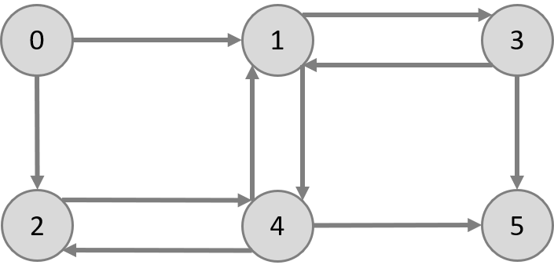

# InfluenceMaximizationBenchmarker

The InfluenceMaximizationBenchmarker (IMB) is a benchmark suite first published at GRADES-NDA 2021:

> Heiko Geppert, Sukanya Bhowmik, and Kurt Rothermel. 2021. Large-scale Influence Maximization with the Influence Maximization Benchmarker Suite. In 4th Joint International Workshop on Graph Data Management Experiences & Systems (GRADES) and Network Data Analytics (NDA) (GRADES-NDA’21), June 20–25, 2021, Virtual Event, China. ACM, New York, NY, USA, 11 pages. https://doi.org/10.1145/3461837.3464510

IMB provides easy to use implementation of the Influence Maximization (IM) problem.


## Building

### Dependencies

*  cmake (3.14 or higher)
*  clang or GCC (9.2 or higher)

### How to build

```
mkdir build
cd build
cmake -G "Unix Makefiles" -DCMAKE_BUILD_TYPE=Release -DUSE_CLANG=0 ..
make -j4
```

## Running

Running Degree Discount and Update Approximation (UA) with a hop distance of 3 on the epinions vertex list. 

`./InfluenceMaximizer --graph ./data/epinions.txt --format 1 --algorithm degree,ua,3`

### Parameters
| short parameter | long parameter | type | description |
|---|---|---|---|
|-g | --graph | string | path to the graph file |
|-f| --format | int | format of the graph file. 0 = vertex list, 1 = edge list. Default=0 |
|-o | --output | string | path to an (optional) output file, where the result set is written |
|-s | --simulations | int | number of influence propagations simulations that are performed to evaluate the result set (only affects the evaluation). Default=20,000|
|-t | --threads | int | number of threads to be used (affects only some algrithms). Default=#CPU-cores|
|-k | --seeds | int | number of seed nodes to be searched (result set size) |
|-a | --algorithm | string | algorithms to be used. Multiple possible (comma separated). See table below for possible options.|
|-r | --raw | None | Flag to produce non pretty (raw) outputs. Great for machine parsing. |
|-i | --inverse | None | Flag, if set, the edge directions will be inversed. |

#### Algorithms
| original name | parameter name | arguments | 
|---|---|---|
| PageRank | pagerank | none |
| High Degree | highdegree | none |
| Degree Discount | degree | none |
| Random | random | none |
| CELF-Greedy | celf | int: number of MC simulations per vertex calculation, Default=10,000 |
| Influence Path Algorithm (IPA) | ipa | int: divider of the IPA threshold, Default=320 |
| Weighted Degree | wd | none |
| EaSyIM | easyim | int: hop distance, Default=3|
| EaSyIM-Delta | easyim-delta | int: hop distance, Default=3 |
| Update Approximation | ua | int: hop distance, Default=3 |
| IMM | imm | none |

Note: IMM is not sufficiently tested yet and should be used with caution.

#### original papers:
**CELF-Greedy:**
Jure Leskovec, Andreas Krause, Carlos Guestrin, Christos Faloutsos, Jeanne VanBriesen, and Natalie Glance. 2007. Cost-effective outbreak detection in networks. In <i>Proceedings of the 13th ACM SIGKDD international conference on Knowledge discovery and data mining</i> (<i>KDD '07</i>). Association for Computing Machinery, New York, NY, USA, 420–429. DOI:https://doi.org/10.1145/1281192.1281239

**Influence Path Algorithm (IPA):**
J. Kim, S. Kim and H. Yu, "Scalable and parallelizable processing of influence maximization for large-scale social networks?," 2013 IEEE 29th International Conference on Data Engineering (ICDE), 2013, pp. 266-277, doi: 10.1109/ICDE.2013.6544831.

**EaSyIM:** 
Sainyam Galhotra, Akhil Arora, and Shourya Roy. 2016. Holistic Influence Maximization: Combining Scalability and Efficiency with Opinion-Aware Models. In <i>Proceedings of the 2016 International Conference on Management of Data</i> (<i>SIGMOD '16</i>). Association for Computing Machinery, New York, NY, USA, 743–758. DOI:https://doi.org/10.1145/2882903.2882929

**Update Approximation:** 
Heiko Geppert, Sukanya Bhowmik, and Kurt Rothermel. 2021. Large-scale Influence Maximization with the Influence Maximization Benchmarker Suite. In 4th Joint International Workshop on Graph Data Management Experiences & Systems (GRADES) and Network Data Analytics (NDA) (GRADES-NDA’21), June 20–25, 2021, Virtual Event, China. ACM, New York, NY, USA, 11 pages. https://doi.org/10.1145/3461837.3464510


**IMM:** 
Youze Tang, Yanchen Shi, and Xiaokui Xiao. 2015. Influence Maximization in Near-Linear Time: A Martingale Approach. In <i>Proceedings of the 2015 ACM SIGMOD International Conference on Management of Data</i> (<i>SIGMOD '15</i>). Association for Computing Machinery, New York, NY, USA, 1539–1554. DOI:https://doi.org/10.1145/2723372.2723734


## Input Format

The input graphs can be provided in two formats: vertex lists and edge lists.
Examples can be found in the 'data' directory.



### Vertex List
Vertex list files should have the following structure, with one vertex per line.
Thereby, the node_ids and need to start at 0 and the nodes need to be given in ascending order to their id, without any gaps in the ids.

```
node_id:neighbour1_id,neighbour2_id,...
```

minimal example with 6 nodes:

```
0:1,2
1:3,4
2:4
3:1,5
4:1,2,5
5:
```

### Edge List
The edge lists need to have one edge with source and destination id per line.
The ids need to start with 0 and my not have any gaps.
However, the ordering in the file doesn't matter.
Note that vertices without neighbors can not be modeled this way (but they are of no interest for influence maximization anyway).

```
source destination
...
```

minimal example with 6 nodes (same as above):

```
0 1
0 2
1 3
1 4
2 4
3 1
3 5
4 1
4 2
4 5
```

