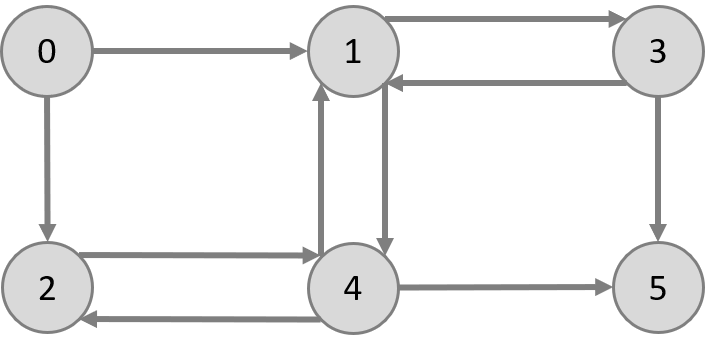

# Input Documentation

The InfluenceMaximizationBenchmarker can currently read two file formats:
- vertex lists
- edge lists

The default for edge weights is to use the inverse indegree.
However, when using edge lists custom weights can be given.


In the following we use this sample graph:



## Vertex List
Vertex list files should have the following structure, with one vertex per line.
Thereby, the node_ids and need to start at 0 and the nodes need to be given in ascending order to their id, without any gaps in the ids.

To parse a vertex list the file type parameter needs to be 0: `-f 0`.

```
node_id:neighbour1_id,neighbour2_id,...
```

minimal example with 6 nodes:

```
0:1,2
1:3,4
2:4
3:1,5
4:1,2,5
5:
```

## Edge List
Each line represents one edge with source and destination id.
The ids should start with 0 and not have any gaps.
The ordering in the file doesn't matter.
Note that vertices without neighbors can not be modeled this way (but they are of no interest for influence maximization anyway).

To parse an edge list the file type parameter needs to be 1: `-f 1`.

```
source destination
...
```

minimal example with 6 nodes (same as above):

```
0 1
0 2
1 3
1 4
2 4
3 1
3 5
4 1
4 2
4 5
```


### Weighted Edge List

The weighted edge list extends the edge list by a third column, representing the weight (as a float).
As before, the ids should  with 0 and not have any gaps.

When inporting an edge list, given weights will be detected automatically. 
Hence, the file type parameter is also 1: `-f 1`.


```
source destination weight
...
```

minimal example with 6 nodes (same as above), with arbitrary weights:

```
0 1 0.1
0 2 0.32
1 3 0.12
1 4 0.45
2 4 0.31
3 1 0.26
3 5 0.19
4 1 0.3
4 2 0.05567
4 5 0.25
```
